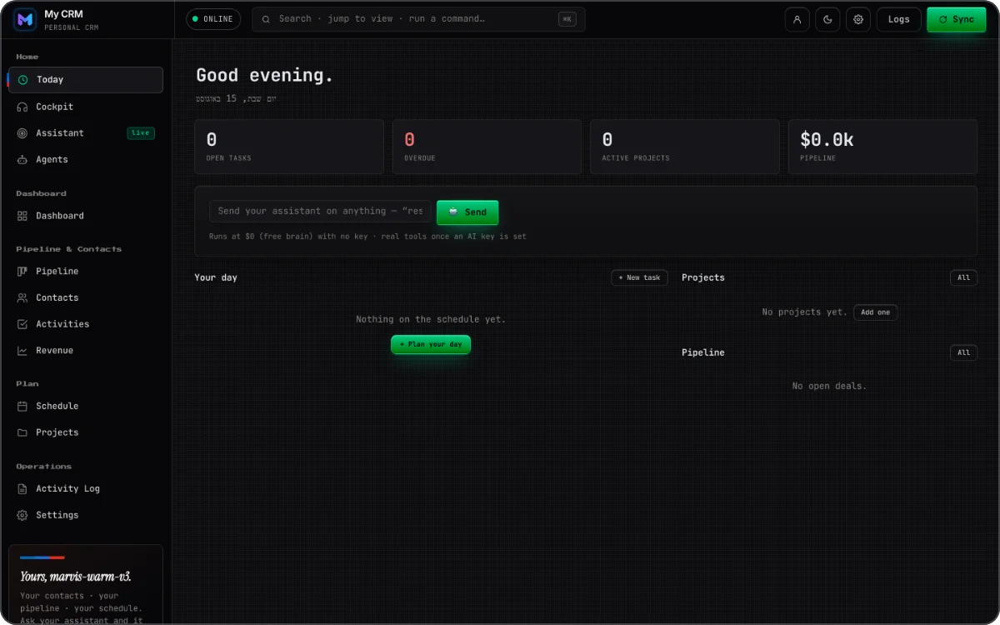
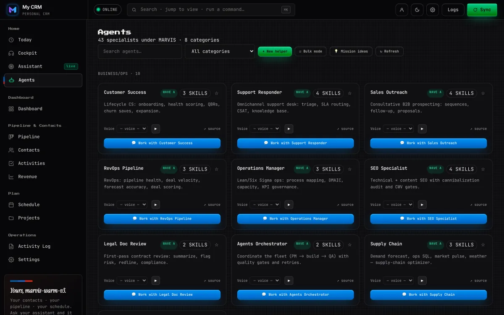
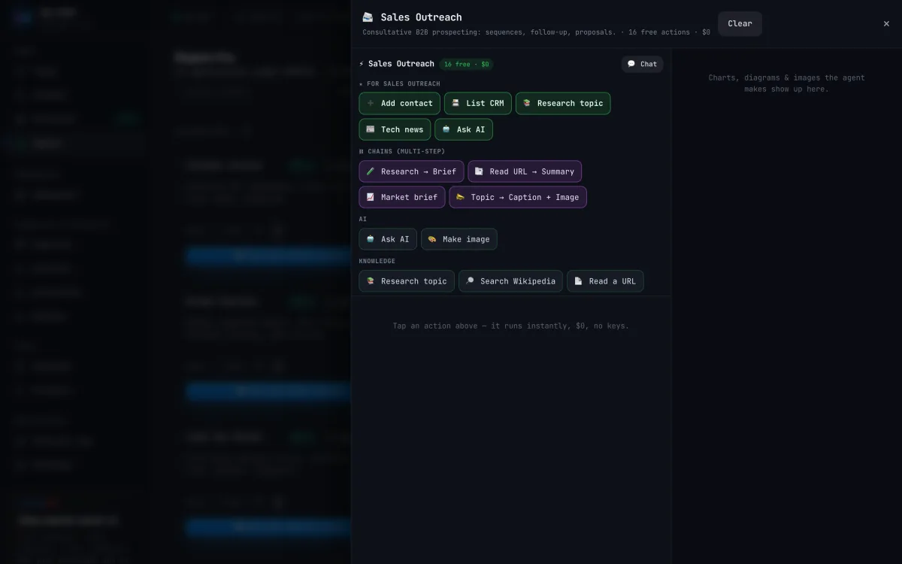
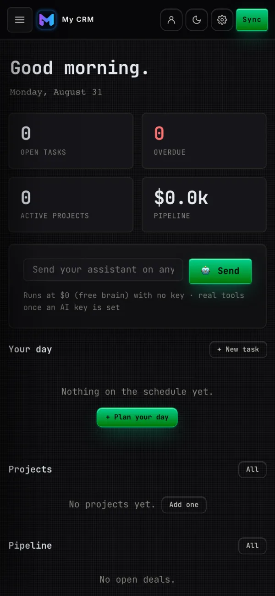

# Bot-UI

**A personal CRM for two people — leads, contacts, a deal pipeline, a personal schedule and projects — with a 43-agent assistant fleet you can send at any to-do. Built for one operator and a partner, not a sales team.**

Live: **[marvis-one.vercel.app](https://marvis-one.vercel.app)**

  

It started as eBot, a voice-first AI cockpit, and was re-centered into a CRM in June 2026 as an adaptation rather than a rewrite: the pipeline and the 60-second scheduler already existed, so the work was adding Projects and Schedule, reframing 77 user-facing strings, and folding the eight AI surfaces behind one **Assistant** entry. Repo and storage keys stay `bot-ui`/`marvis` for compatibility.

## Screenshots

  

## Sending a bot at a to-do and getting the answer back on the item

Every to-do carries a **Send bot** action: `sendTodoToBot(id)` opens the agent workspace with `{mission, onDone}`, and the `onDone` hook fires the settled final text back onto the item (`lastResult`, `runs[]`) as an inline result card. Opt-in **auto-start when due** lets the 60s heartbeat prepare a briefing unattended, free brain only: no tools, no confirm cards, no side effects. Unattended spend is the wrong default.

## Running the whole assistant fleet at $0

`/api/ai` tries Cloudflare Workers AI, Groq, Gemini, then OpenRouter — first env key wins — and returns `503 no_free_brain` when none is set; the client then falls back to keyless Pollinations. Beside it sit 16 keyless browser-direct actions (Wikipedia, a URL reader, GitHub, crypto, weather, markets, on-device TTS, charts), and a local-first localStorage store keeps agents and templates working without the optional Fastify backend. Paid capability is opt-in behind one proxy: `/api/proxy` fronts 95 providers in 17 categories keyed off env vars, and a 31-skill registry takes the first ranked route whose key is present.

## Merging a boot pull without eating local edits

A shared-workspace code overrides `Sync.clientId()` so both partners write one Supabase row once `SUPABASE_URL`/`SUPABASE_SERVICE_ROLE_KEY` are set — they are not set today, so `/api/state` answers `503 no_supabase` and the app runs local-first. `pullAndMerge` does a per-id union with last-write-wins on todos/projects/meetings, so a boot pull cannot clobber locally created items. With no Supabase configured the topbar Sync button reports "Saved on this device — cloud sync is off" rather than faking sync.

## Closing an auth kill-switch

An earlier hardening pass was latent breakage: the client never sent `x-api-secret`, so setting `PROXY_SECRET` would have 401'd every dispatch, voice and proxy call. `apiJsonHeaders()` now attaches it to every same-origin `/api/*` POST and to the `/api/state` sync calls, and `api/state.js` came under the same gate. Around it: per-IP rate limits, an `ALLOWED_ORIGINS` allowlist, and a write audit log that records parameter *key names* only.

## How it was verified

- **86 DOM assertions and an 8-check fresh-load smoke, all green** in a real Chrome DOM. The anti-clone guard wipes the page and the edge 403s automation on the live host, so the harness spoofs `navigator.webdriver` over `file://` and live checks are curl-based.
- **196 backend test cases** (validators, voice intent, SSE stream, DB mock), growing to a 258-pass suite after the D1 boolean-binding fix, plus a 6-tier manual E2E checklist.
- A **10-scenario harness** drove the real workspace code against the real server-side `frameMessages` to check every request body against the Anthropic tool-use contract — parallel tools, declined writes, transient 503, threads past the window cap.
- **Live checks**: `/api/agents` returns 43 agents; `/api/chat` answers `503 no_key` rather than `401` while `PROXY_SECRET` is unset, so the keyless path stays open; `/api/market` returns real Yahoo Finance prices.

## What it runs on

`vanilla HTML/CSS/JS` `~1MB single-file shell` `Vercel Edge Functions` `TypeScript` `Supabase sync (env unset)` `Cloudflare D1 (cutover pending)` `network-first service worker` `PWA` `inline SVG charts`

Source is private. Built by [@shear559](https://github.com/shear559).
